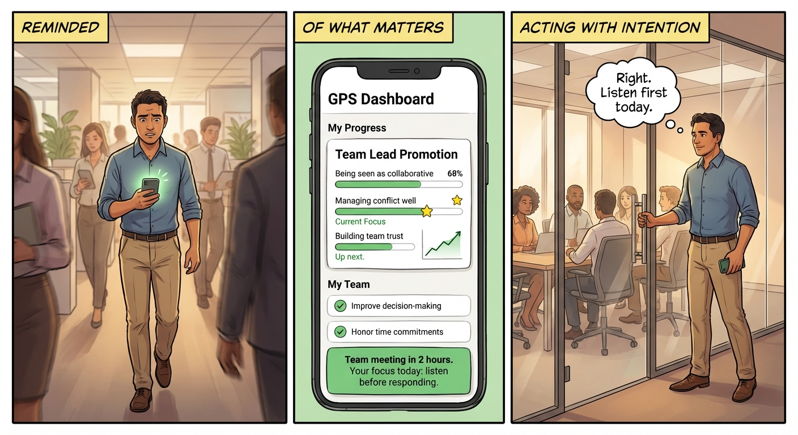

# Why We're Building This

> **Audience:** Internal team + Oseas. Get sign-off and excitement.
> **Purpose:** The punchy "why" that sits on top of the detailed specs.

---

## Why We Exist

Coaching doesn't scale. Behavior change apps don't work. We're building the bridge.

| Coaching today | Apps today | What's missing |
|----------------|-----------|----------------|
| Powerful but expensive. One coach, one person, no scale. | They track habits. They count streaks. They don't help you actually change. | A system that remembers your journey, adapts when you struggle, and connects daily actions to who you want to become. |

---

## What We're Building

An AI coach with memory that owns the entire behavior change cycle.

Not a chatbot. A system that knows where you started, what you're working on, where you've struggled, and what's next — and uses all of that to guide you.

---

## Why This Unlocks Everything

The AI Coach with memory is the core engine. Once it works, it powers two design spaces we care about:

**AI Coach with Memory** →

- **Leadership Development** — Individual behavior change at scale. The product we're building now.
- **Team Effectiveness** — Team-level coaching that works because individuals are actually growing.

We're not choosing between these markets — we're building the foundation that makes both possible.

---

## What We're Proving in Q1

Three things that validate the bet:

- **Multi-session Coach** — the AI remembers and builds on past conversations
- **MS Teams integration** — reach people where they already work
- **The full cycle** — goal-setting to daily practice to adjustment, end to end

---

*For the detailed product spec, see [vision-behavior-change.md](vision-behavior-change.md). For the platform vision, see [vision.md](vision.md).*
