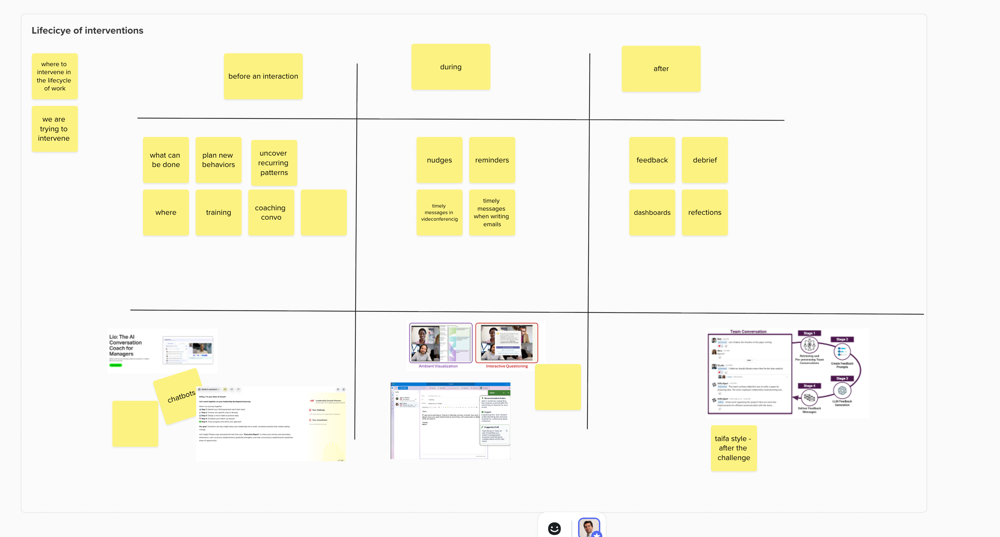
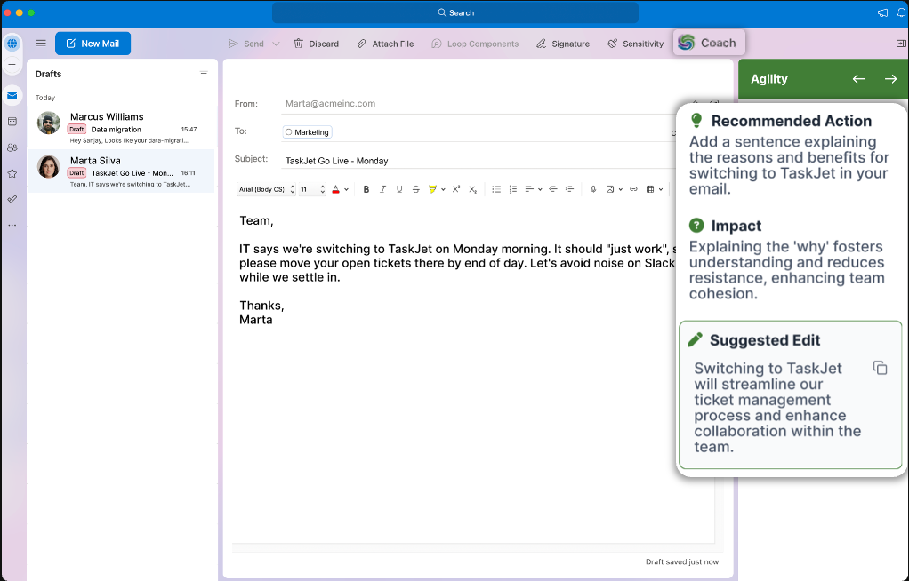
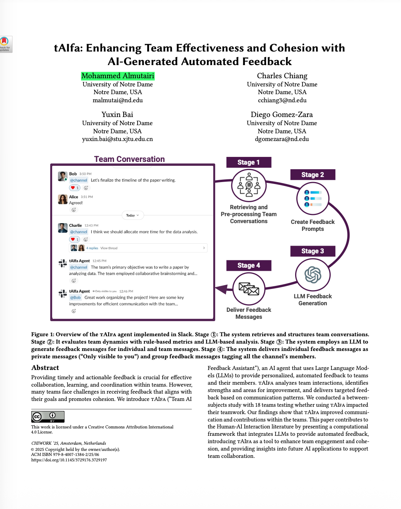

# Research References: Team Effectiveness Design

> References from HCI/CSCW research and industry products that illustrate the product concepts in Design Space 2 (Team Effectiveness). Organized around the **Lifecycle of Interventions** — before, during, and after team interactions.

---

## The Lifecycle of Interventions

The organizing framework: where in the lifecycle of work do we intervene, and what are we trying to change?

| | **Before** an interaction | **During** | **After** |
|---|---|---|---|
| **What we can do** | Plan new behaviors, uncover recurring patterns, coaching conversations, training | Nudges, reminders, timely messages in videoconferencing/email | Feedback, debrief, dashboards, reflections |
| **Research/product reference** | Lio chatbot (MindGym) | "Are We On Track?" (Chen et al.) + SculptureAI (MindGym) | tAIfa (Gomez-Zara, Notre Dame) |

---

## Before: AI Coaching for Managers

### Lio (MindGym)

**Source:** MindGym — https://themindgym.com/sculptureai

**What it is:** An AI conversation coach chatbot for managers. Helps leaders prepare for difficult conversations, plan new behaviors, and practice before real interactions.

**Connection to our product:** Maps to the "before" column — coaching conversations that prepare individuals before team interactions. This is what our AI Coach already does in the individual path; the team effectiveness angle is coaching people specifically in preparation for team moments (difficult feedback, alignment conversations, etc.).

---

## During: Meeting Facilitation + In-Flow Nudging

### SculptureAI (MindGym) — Real-Time Coaching in the Flow of Work

**Source:** MindGym — https://themindgym.com/sculptureai

**What it is:** An AI coach embedded directly in Outlook (and other work tools). As you write an email to your team, it provides real-time nudges: recommended actions, impact explanations, and suggested edits. Example: you're sending a directive email about switching tools — SculptureAI suggests adding a sentence explaining the "why" to foster understanding and reduce resistance.

**Connection to our product:** This is the "Pepe Grillo" concept — the coach present in your day-to-day work, not just when you open the app. For team effectiveness, it means coaching people on *how* they communicate with their team in real time. "Timely messages when writing emails" from the intervention lifecycle.

### "Are We On Track?" — AI-Assisted Goal Reflection During Meetings

**Paper:** Chen, Tankelevitch, Vanukuru, Scott, Panda, Rintel. "Are We On Track? AI-Assisted Active and Passive Goal Reflection During Meetings." University of Michigan, Microsoft Research, UCL, CU Boulder.

**What it is:** A technology probe exploring two modes of AI support during team meetings:

- **Ambient Visualization** (passive): A dashboard with a topic timeline and goal panel that evolves as the meeting progresses. Low engagement, high AI interpretation. Shows what's being discussed and how it connects to stated goals — without interrupting.
- **Interactive Questioning** (active): AI asks reflective questions during the meeting to prompt the team to assess whether they're on track. Higher engagement, lower AI interpretation.

**Key findings (relevant to us):**
- Providing an agenda is not the same as tracking goals — teams need external artifacts for in-meeting goal tracking
- Benefits: enhances individual sensemaking, drives action during and post-meeting, builds shared context
- Concerns: cognitive load, timing/synchronicity of AI nudges, impact on social dynamics
- Design dimensions: what to reflect on (descriptive → actionable), when to reflect (objective vs subjective timing), who should reflect (role-specific needs, balancing democratic input with efficiency)

**Connection to our product:** This is exactly the "meeting facilitation support" concept — augmenting what a consultant does during team facilitation. The ambient visualization mode is particularly relevant: a live dashboard that makes invisible meeting dynamics visible.

---

## After: Team Conversation Tracking & Automated Feedback

### tAIfa — Enhancing Team Effectiveness with AI-Generated Automated Feedback

**Paper:** Almutairi, Chiang, Bai, Gomez-Zara. "tAIfa: Enhancing Team Effectiveness and Cohesion with AI-Generated Automated Feedback." University of Notre Dame. CHIWORK '25.

**What it is:** An AI agent (tAIfa = "Team AI Feedback Assistant") that lives in team Slack and provides automated feedback on team dynamics. Four-stage pipeline:

1. **Retrieve & pre-process** team conversations from Slack
2. **Create feedback prompts** using rule-based metrics + LLM analysis
3. **Generate feedback** via LLM — both team-level and individual
4. **Deliver feedback** — team feedback as public channel messages, individual feedback as private messages ("Only visible to you")

**Key findings:**
- 18-team between-subjects study showed tAIfa improved communication and contributions within teams
- The dual delivery model (public team feedback + private individual nudges) is powerful
- Integrates into the flow of work (Slack) rather than requiring a separate tool

**Connection to our product:** This maps to "team conversation tracking" — capturing what happens in team conversations and surfacing patterns. The private individual feedback is essentially what our AI Coach does in team context ("I see the team committed to X — how is that showing up for you?"). tAIfa works **asynchronously** on ongoing conversations, not during structured meetings.

---

## Research Groups

| University | Researcher | Relevance |
|------------|------------|-----------|
| Notre Dame | Diego Gómez-Zará | tAIfa — downloaded code to study |
| Clemson | Nathan McNeese | Team performance frameworks |
| Rice | Unhelkar (Socratic) | Via Thierry |
| Michigan + Microsoft Research | Chen, Tankelevitch, Rintel | "Are We On Track?" meeting facilitation |

These groups come from the HCI/CSCW tradition — designing systems with the right interactions for usefulness and usability. They've applied team performance frameworks for automated feedback in experimental settings, with clear findings on what interactions work and how to measure impact.

---

*Added: January 28, 2026*
