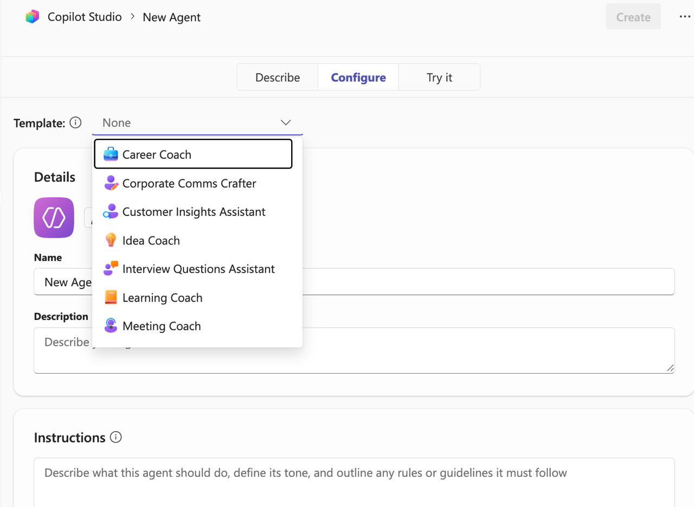
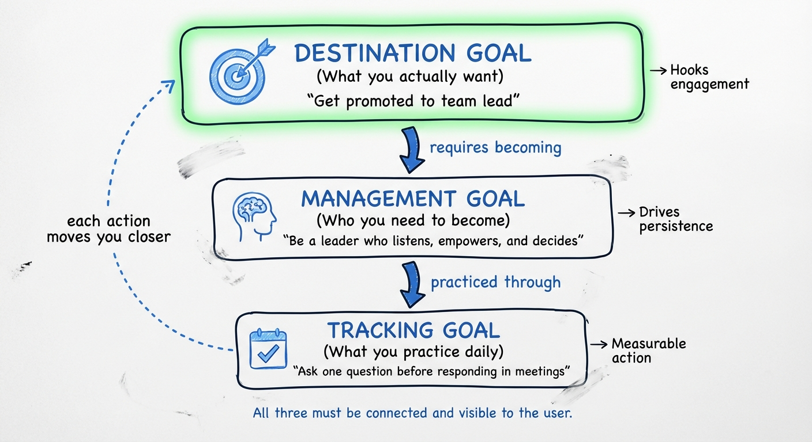
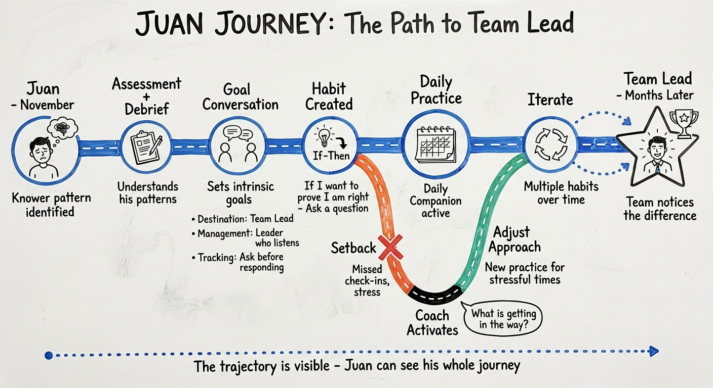
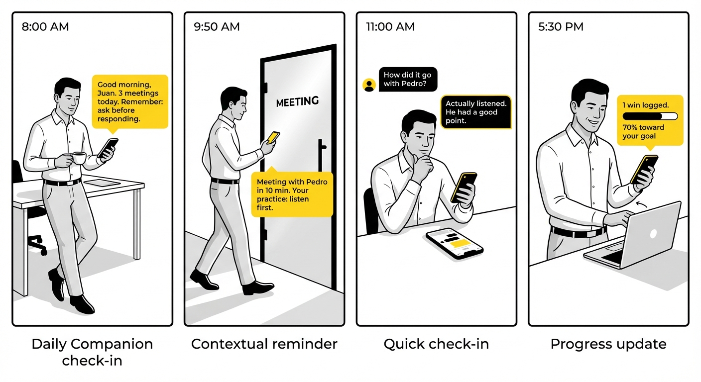
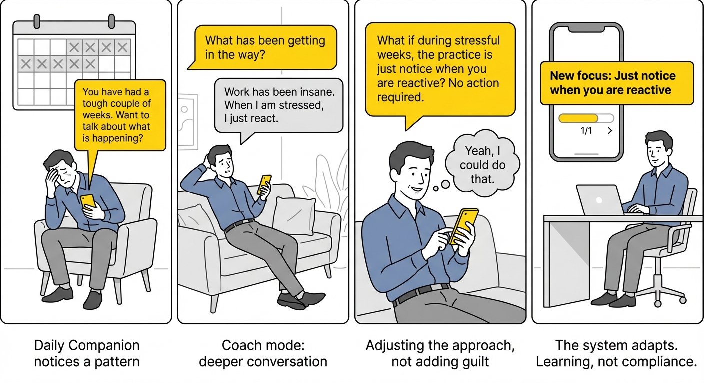
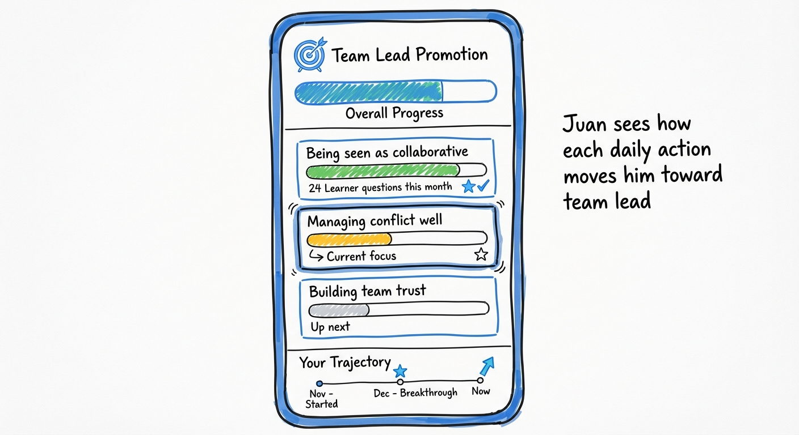

# Conscious Insights - Vision for Behavior Change

> **Purpose:** The "what" and "why" — methodology, user journey, system design
> **See also:** [vision.md](vision.md) for platform vision, [roadmap.md](roadmap.md) for engineering roadmap, [alignment.md](alignment.md) for leadership sign-off

---

## 1. Why This Vision

We face two problems that demand a new direction.

### Problem 1: The Product is Vulnerable

The current product works. It has value. Clients understand it.

But the market sees us as "a chatbot." We learned this with Sigma — an advanced client who saw us as just another tool.



The market is changing fast. Anyone with access to Claude or GPT can build a coaching chatbot with good prompting. If we stay where we are, we'll be just another one in the crowd.

**We need to own the entire behavior change cycle, not just offer conversations.**

### Problem 2: People Struggle to Change

Self-development is hard. People don't naturally persist.

> "Sigo teniendo esta impresión de que si el producto está diseñado para ayudarle a personas a que hagan un proceso de crecimiento de propia voluntad... nos pone en una situación muy vulnerable, en tanto en cuanto no es lo normal que las personas hagamos eso y que seamos consistentes."

Current tools track habits but don't help people ACTUALLY change. They nag when you fail instead of helping you adapt. They count streaks instead of connecting daily actions to what you really want.

**We're integrating the best research on how change happens — from HCI, behavioral science, and longitudinal goal-setting studies — to build a system that actually helps people change.**

### Our Response

1. Build a system grounded in research on what makes people persist
2. Own the complete cycle: goals → gaps → habits → adjustment → evolution
3. Not just a coach that talks — a system that guides real change

---

## 2. The Bet

We are going to own the behavior change cycle.

> "Si nos quedamos como 'tenemos un chatbot de coaching', competimos con todos. Si nos posicionamos como 'somos dueños del ciclo de cambio de comportamiento', es otra conversación."

### What is NOT Easy to Replicate

- **The complete behavior change methodology** — grounded in research, not intuition
- **The system that orchestrates the entire cycle** — not just a conversation, but goals, habits, adjustments, evolution
- **The integrations that create real stickiness** — we reach users where they already are
- **The accumulated knowledge about what works** — what interventions move people, when, how
- **The structured memory of the user's change trajectory** — not just chat history, but a model of their growth

**That's what we're going to build.**

---

## 3. The Coach Relationship

You have one coach. Not a coach AND a companion — just a coach who shows up in different ways depending on what you need.

This is how real coaching works. When your coach texts to check how a conversation went, they don't become a "different mode" — they're still your coach.

### Four Touchpoints

| Touchpoint | Intensity | Who initiates | What it is |
|------------|-----------|---------------|------------|
| **Scheduled sessions** | Deep | User (planned) | Full coaching conversations (weekly/biweekly). Works through your agenda. Follows 8-step methodology. |
| **On-demand** | Medium | User (urgent) | Quick tactical help. Bounce ideas, prepare for a meeting, process a situation. |
| **Check-ins** | Light | Coach (proactive) | "How did that conversation go?" Context-aware follow-up on commitments. |
| **Reminders** | Light | Coach (proactive) | "Remember your practice today." Connects daily action to your goals. |

All touchpoints share the same memory, same context, same relationship. Progress from all feeds into your GPS Dashboard.

### How You Interact with Your Coach

| Moment | Touchpoint | What Happens |
|--------|------------|--------------|
| Starting out | Scheduled session | Set goals, understand yourself, create the plan |
| Weekly session | Scheduled session | Work through your agenda, full coaching conversation |
| Urgent need | On-demand | Quick tactical help — prepare, reflect, problem-solve |
| Day to day | Check-ins + Reminders | Practice habits, track progress, stay connected |
| Hit a setback | Scheduled or On-demand | Process what happened, adjust approach |
| Pattern detected | Coach reaches out | "You've struggled for 2 weeks. Let's talk." |

### Discoverability & User Mental Model

Users need a clear mental model of how the system can help them and for what. Without this, they default to treating it as a generic chatbot — or worse, they don't reach for it when they need it.

**Design principles:**

1. **Anchor to "what's in it for me"** — The system serves the user's personal agenda (career growth, avoiding problems, being effective), not the company's agenda. Intrinsic motivation drives engagement.

2. **Make capabilities visible** — The interface should surface use cases: coaching sessions, emergency help, career conversations. New chat suggestions (like ChatGPT/Claude) help users discover what's possible.

3. **Proactive, personalized outreach** — Don't send generic check-ins ("how's it going?"). Use context from previous sessions to ask about what matters to them. Connect to their calendar if available.

> "Todo esto tiene que estar girado acerca de lo que a mí me importa, no de lo que la compañía quiere de mí."

---

## 4. The Goal Hierarchy

Persistence requires connecting daily actions to what people really want. We use a three-level hierarchy:



### Why This Matters

- **Destination Goals** get people started — promotions, being liked, avoiding problems
- **Management Goals** keep people going — intrinsic motivation drives long-term engagement
- **Tracking Goals** make it concrete — you can't practice "be a better leader," but you can practice "ask one question before responding"

**All three must be connected and visible.**

### This is the Anchor

The Goal Hierarchy is why Session 1 exists (to capture YOUR goals), why the GPS Dashboard exists (to show YOUR progress), and why the whole system works — because it's built around what matters to you, not what the company wants from you.

Everything flows from this: the coaching agenda is YOUR agenda, the check-ins ask about YOUR commitments, the progress you see is toward YOUR destination. Without this anchor, we're just another corporate training tool. With it, we're a system that helps people change because they want to.

---

## 5. The Change Process

Four stages, all facilitated by the Coach through different touchpoints:

| Stage | Touchpoint | What Happens |
|-------|------------|--------------|
| **Know Yourself** | Scheduled session | Assessment + Debrief → understand your patterns |
| **Establish Agenda** | Scheduled session | User defines their themes/priorities for coaching |
| **Work the Agenda** | Scheduled + On-demand | Sessions address agenda items using appropriate tools |
| **Daily Practice** | Check-ins + Reminders | Practice habits, track progress, GPS updates |

**Key insight:** Goals must be OWNED (from intrinsic conversation), not ASSIGNED (from assessment alone).

### Conscious Business Tools

The Coach uses Conscious Business methodology — microhabits are a tracking mechanism, not the core toolset:

| Category | Tools |
|----------|-------|
| **Mindsets** | Player (protagonist vs victim), Learner (vs Knower), Essential Integrity |
| **Conversations** | Difficult Conversations, Feedback, Requests & Commitments |
| **Conflict** | Agreements, Conflict Resolution, BATNA |

> See `research/coaching/axialent-coaching-handbook-summary.md` for full methodology.

---

## 5b. Coach Session Structure

### The Coaching Process

| Phase | Purpose |
|-------|---------|
| **Session 1: Establish Agenda** | Understand what's important to the person — goals, themes, priorities. NOT a coaching conversation. |
| **Sessions 2+: Work the Agenda** | Regular coaching sessions (weekly or biweekly). Each follows Application Coaching methodology (8 steps below). |
| **Final Session: Closing** | Recap learnings, celebrate progress, close the process. |
| **Maintenance** | After the main process: periodic check-ins (monthly or as needed) to sustain progress and address new challenges. |

### Four Touchpoints in Practice

| Touchpoint | When | What it is |
|------------|------|------------|
| **Scheduled Sessions** | Weekly/biweekly, planned | Full coaching conversation for development. Works through your agenda systematically. |
| **On-Demand Sessions** | Anytime, user-initiated | Quick, tactical help. Bounce ideas, reflect, prepare for something specific. |
| **Check-ins** | After commitments, context-aware | Coach follows up on what matters. "How did that conversation go?" |
| **Reminders** | Daily, tied to practices | Light touches that connect daily action to goals. |

**On-demand examples:**
- "I have a conversation with my boss in an hour — help me prepare"
- "I'm having a weird feeling about this situation — quick check-in"
- "How should I handle this specific thing?"

**Check-in examples:**
- "You had that conversation with your manager yesterday. How did it go?"
- "You've been working on asking questions before responding. Any wins this week?"

All touchpoints are the same coach — just different intensities. The system should make each easily accessible (see Discoverability above).

### Each Coaching Conversation (Sessions 2+)

| Step | What Happens |
|------|--------------|
| 1. Preparación | Coach reviews context; user prepares situation to work on |
| 2. Apertura | Build connection, set context |
| 3. Comprensión | Understand the gap — current state vs desired state |
| 4. Contrato | Agree on objectives for this session |
| 5. Resolución | Work the problem (CB tools, role plays) |
| 6. Compromiso | Commit to specific action with deadline |
| 7. Cierre | Reflect on learnings, anchor |
| 8. Seguimiento | Follow up on commitments between sessions |

> "Si no hay brecha, no hay coaching."

---

## 6. The Adjust Stage

When users fail, most systems just track the failure. That doesn't help.

| Don't | Do |
|-------|-----|
| Track failure ("You missed 3 days") | Reinterpret ("What got in the way?") |
| Nag ("Remember your habit!") | Anticipate barriers ("Tough week ahead. Let's plan.") |
| Create guilt | Help learn a new skill or approach |

When the Coach detects a pattern in your check-ins (missed days, negative sentiment), it suggests a deeper conversation — not to guilt, but to help adapt.

**The goal is learning, not compliance.**

---

## 7. Juan's Journey

Juan wants to be seen as someone people want on their team — and get promoted to team lead.



### The Arc

| Stage | What Happens | Result |
|-------|--------------|--------|
| Assessment + Debrief | Discovers his "Knower" pattern | Understands himself |
| Goal Conversation | Sets intrinsic goals with Coach | Destination: Team Lead, Management: Leader who listens |
| Habit Created | Creates If-Then practice | "If I want to prove I'm right → Ask a question" |
| Daily Practice | Coach sends check-ins and reminders, tracks progress | GPS updates, wins logged |
| Setback + Adjust | Misses check-ins → Coach helps adapt | New practice for stressful times |
| Sustained Change | Multiple iterations over months | Gets the promotion |

### Daily Practice in Action



### When Setbacks Happen



**The trajectory is visible.** Juan can see where he started, what he worked on, and where he is now.

---

## 8. The Goals Dashboard (GPS)

The user must see that each daily action moves them toward their destination. This is the "GPS" that keeps them walking.



### Key Principles

- **Connection is visible** — Every habit completion updates progress toward Destination Goal
- **Trajectory, not just state** — Shows where you started, key moments, where you are
- **Wins are captured** — Not just counts, but specific moments that mattered
- **Next focus is clear** — What you're working on now vs. what's coming

---

## 9. Architecture

### System Overview

```
┌─────────────────────────────────────────────────────────────────┐
│                     INTEGRATED UX LAYER                         │
│             (One system from user's perspective)                │
│                                                                 │
│  ┌───────────────────────────────────────────────────────────┐  │
│  │                        COACH                              │  │
│  │  ┌───────────┬───────────┬───────────┬─────────────────┐  │  │
│  │  │ Scheduled │ On-Demand │ Check-ins │    Reminders    │  │  │
│  │  └───────────┴───────────┴───────────┴─────────────────┘  │  │
│  └───────────────────────────────────────────────────────────┘  │
└─────────────────────────────────────────────────────────────────┘
                              │
                              ▼
┌─────────────────────────────────────────────────────────────────┐
│                    STRUCTURED MEMORY                            │
│                (User's change trajectory)                       │
│                                                                 │
│   • Goal Hierarchy (Destination → Management → Tracking)        │
│   • Where they started (assessment, initial gap)                │
│   • What they've worked on (habits, coaching sessions)          │
│   • Key moments (setbacks, insights, wins)                      │
│   • Current state and focus                                     │
│                                                                 │
│   Technical: Exploring Graphiti or similar for relationships    │
└─────────────────────────────────────────────────────────────────┘
                              │
                              ▼
┌─────────────────────────────────────────────────────────────────┐
│                    CONTEXT MANAGER                              │
│          (Pulls information from user's world)                  │
└─────────────────────────────────────────────────────────────────┘
                              │
              ┌───────────────┼───────────────┐
              ▼               ▼               ▼
         ┌─────────┐    ┌─────────┐     ┌─────────┐
         │MS Teams │    │Calendar │     │ Email   │
         │(Q1 2026)│    │(Future) │     │(Future) │
         └─────────┘    └─────────┘     └─────────┘
```

### How Architecture Maps to User Journey

| User Stage | System Component |
|------------|------------------|
| Know Yourself | Assessment + Coach (Scheduled) |
| Set Intrinsic Goals | Coach (Scheduled) + Structured Memory (stores Goal Hierarchy) |
| Connect to Action | Coach creates practices → Check-ins + Reminders begin |
| Daily Practice | Coach (Check-ins + Reminders) + Context Manager (MS Teams) |
| Adjust | Coach detects pattern → suggests deeper conversation |
| View Progress | GPS Dashboard reads from Structured Memory |

---

# Appendix

## A. Research Foundations

### Goal Hierarchy Framework

From longitudinal goal-setting research:

- **Management Goals** = The desired professional/personal state (who you want to be)
- **Tracking Goals** = The specific behaviors that move you there (what you do daily)
- Persistence requires connecting tracking to management to destination

### IIMC: Implementation Intentions + Mental Contrasting

Two evidence-based techniques for behavior change:

**Mental Contrasting:**
1. Visualize the desired future (Destination Goal achieved)
2. Contrast with current obstacles (the Gap)
3. Creates motivation by connecting desire to reality

**Implementation Intentions:**
1. Structure habits as "If X, then Y"
2. The "If" is the trigger (situation, cue, obstacle)
3. The "Then" is the specific action
4. Reduces cognitive load — you've pre-decided what to do

### The Adjust Stage

Research shows persistence fails not at habit formation but at barrier navigation. Effective systems:
- Help users **reinterpret** goals when they fail (not just track failure)
- Help users **anticipate** future barriers
- Help users **learn new skills** when current approach isn't working

### Self-Report Limitations

Relying solely on user self-report has bias. Possible mitigations:
- Peer or manager feedback loops
- Objective behavioral signals (if available)
- Prompting for specific evidence, not just feelings

---

## B. Glossary

| Term | Definition |
|------|------------|
| **Destination Goal** | The extrinsic outcome the user wants (promotion, being liked, avoiding problems) |
| **Management Goal** | The intrinsic mindset shift needed (be a Learner, be a Partner) |
| **Tracking Goal** | The specific microhabit practiced daily |
| **The Gap** | The distance between who the user is and who they want to be |
| **Coach** | One relationship with four touchpoints: scheduled sessions (deep), on-demand (tactical), check-ins (follow-up), reminders (daily practice) |
| **Scheduled Session** | Deep coaching conversation, weekly/biweekly, follows 8-step methodology |
| **On-Demand Session** | Quick tactical help, user-initiated when urgent |
| **Check-in** | Coach-initiated follow-up on commitments and progress, context-aware |
| **Reminder** | Light daily touch connecting action to goals |
| **If-Then Habit** | Implementation Intention format: "If [trigger], then [action]" |
| **Mental Contrasting** | Technique: visualize desired future, contrast with current obstacle |
| **GPS Dashboard** | Visual showing progress toward Destination Goal |
| **Adjust Stage** | When user struggles, system helps reinterpret and adapt (not just track failure) |

---

## C. Hypotheses to Validate

These are bets, not facts:

| Hypothesis | What We Believe |
|------------|-----------------|
| **Intrinsic goal** | Goals from powerful conversation (not just assessment) → more commitment |
| **If-Then** | Habits structured as Implementation Intentions → higher adherence |
| **GPS** | Daily actions visibly connected to Destination Goal → longer persistence |
| **Adjust** | Help users learn from failure (not just track it) → sustained engagement |
| **Integration** | Reach users where they are (MS Teams) → higher interaction frequency |
| **Coach-triggered** | Coach suggests deeper conversation when patterns emerge → more breakthroughs |

---

*Document version: February 2026*
