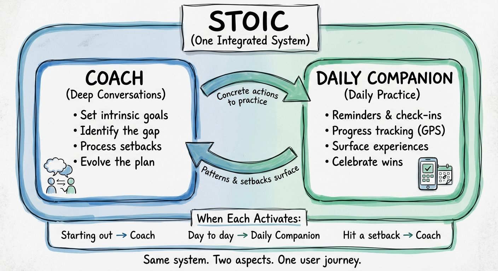
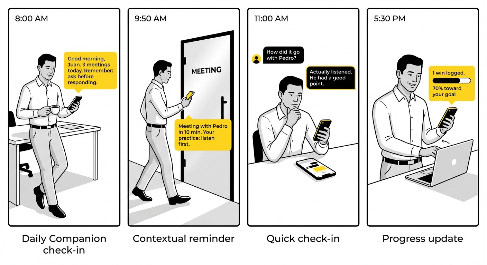
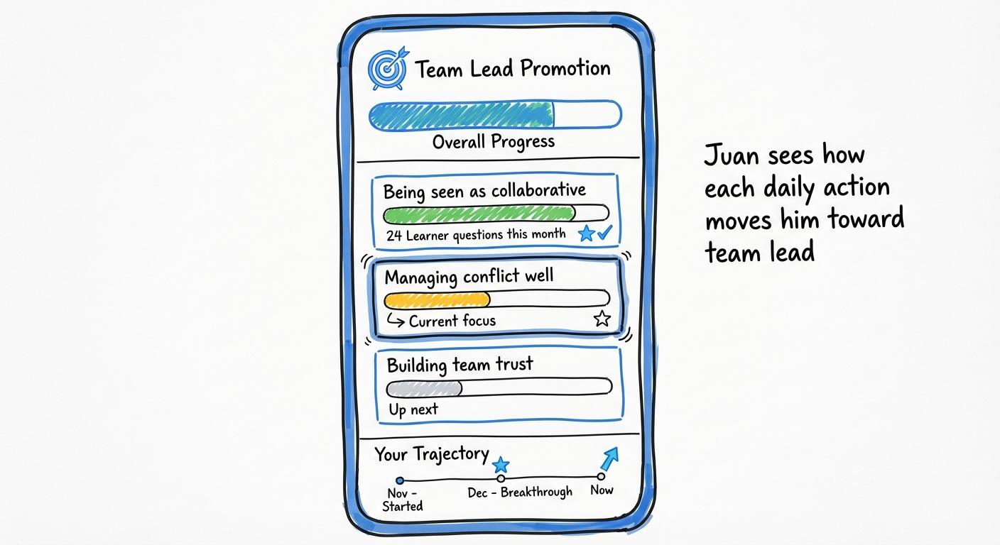

# Conscious Insights - Vision for Behavior Change

> **Purpose:** The "what" and "why" — methodology, user journey, system design
> **See also:** [roadmap.md](roadmap.md) for Q1-H2 features, [alignment.md](alignment.md) for leadership sign-off

---

## 1. Why This Vision

We face two problems that demand a new direction.

### Problem 1: The Product is Vulnerable

The current product works. It has value. Clients understand it.

But the market sees us as "a chatbot." We learned this with Sigma — an advanced client who saw us as just another tool.


The market is changing fast. Anyone with access to Claude or GPT can build a coaching chatbot with good prompting. If we stay where we are, we'll be just another one in the crowd.

**We need to own the entire behavior change cycle, not just offer conversations.**

### Problem 2: People Struggle to Change

Self-development is hard. People don't naturally persist.

> "Sigo teniendo esta impresión de que si el producto está diseñado para ayudarle a personas a que hagan un proceso de crecimiento de propia voluntad... nos pone en una situación muy vulnerable, en tanto en cuanto no es lo normal que las personas hagamos eso y que seamos consistentes."

Current tools track habits but don't help people ACTUALLY change. They nag when you fail instead of helping you adapt. They count streaks instead of connecting daily actions to what you really want.

**We're integrating the best research on how change happens — from HCI, behavioral science, and longitudinal goal-setting studies — to build a system that actually helps people change.**

### Our Response

1. Build a system grounded in research on what makes people persist
2. Own the complete cycle: goals → gaps → habits → adjustment → evolution
3. Not just a coach that talks — a system that guides real change

---

## 2. The Bet

We are going to own the behavior change cycle.

> "Si nos quedamos como 'tenemos un chatbot de coaching', competimos con todos. Si nos posicionamos como 'somos dueños del ciclo de cambio de comportamiento', es otra conversación."

### What is NOT Easy to Replicate

- **The complete behavior change methodology** — grounded in research, not intuition
- **The system that orchestrates the entire cycle** — not just a conversation, but goals, habits, adjustments, evolution
- **The integrations that create real stickiness** — we reach users where they already are
- **The accumulated knowledge about what works** — what interventions move people, when, how
- **The structured memory of the user's change trajectory** — not just chat history, but a model of their growth

**That's what we're going to build.**

---

## 3. One System, Two Modes

The system has two modes — not two separate products, but two aspects of the same experience:



### When Each Mode Activates

| Moment | Mode | What Happens |
|--------|------|--------------|
| Starting out | Coach | Set goals, understand yourself, create the plan |
| Day to day | Daily Companion | Practice habits, track progress, check in |
| Hit a setback | Coach | Process what happened, adjust approach |
| Pattern detected | Coach | "You've struggled for 2 weeks. Let's talk." |

---

## 4. The Goal Hierarchy

Persistence requires connecting daily actions to what people really want. We use a three-level hierarchy:


### Why This Matters

- **Destination Goals** get people started — promotions, being liked, avoiding problems
- **Management Goals** keep people going — intrinsic motivation drives long-term engagement
- **Tracking Goals** make it concrete — you can't practice "be a better leader," but you can practice "ask one question before responding"

**All three must be connected and visible.**

---

## 5. The Change Process

Four stages, facilitated by Coach and Daily Companion:

| Stage | Mode | What Happens |
|-------|------|--------------|
| **Know Yourself** | Coach | Assessment + Debrief → understand your patterns |
| **Set Intrinsic Goals** | Coach | Powerful conversation → OWNED goals (not assigned) |
| **Connect to Action** | Coach → Daily Companion | Create If-Then habit, handoff for execution |
| **Daily Practice** | Daily Companion | Reminders, check-ins, GPS updates |

**Key insight:** Goals must be OWNED (from intrinsic conversation), not ASSIGNED (from assessment alone).

**If-Then Structure:**
> "IF I'm in a meeting and I want to prove I'm right, THEN I ask one question before responding."

---

## 6. The Adjust Stage

When users fail, most systems just track the failure. That doesn't help.

| Don't | Do |
|-------|-----|
| Track failure ("You missed 3 days") | Reinterpret ("What got in the way?") |
| Nag ("Remember your habit!") | Anticipate barriers ("Tough week ahead. Let's plan.") |
| Create guilt | Help learn a new skill or approach |

When Daily Companion detects a pattern (missed days, negative sentiment), it triggers Coach mode — not to guilt, but to help adapt.

**The goal is learning, not compliance.**

---

## 7. Juan's Journey

Juan wants to be seen as someone people want on their team — and get promoted to team lead.


### The Arc

| Stage | What Happens | Result |
|-------|--------------|--------|
| Assessment + Debrief | Discovers his "Knower" pattern | Understands himself |
| Goal Conversation | Sets intrinsic goals with Coach | Destination: Team Lead, Management: Leader who listens |
| Habit Created | Creates If-Then practice | "If I want to prove I'm right → Ask a question" |
| Daily Practice | Daily Companion sends reminders, tracks progress | GPS updates, wins logged |
| Setback + Adjust | Misses check-ins → Coach helps adapt | New practice for stressful times |
| Sustained Change | Multiple iterations over months | Gets the promotion |

### Daily Practice in Action



### When Setbacks Happen


**The trajectory is visible.** Juan can see where he started, what he worked on, and where he is now.

---

## 8. The Goals Dashboard (GPS)

The user must see that each daily action moves them toward their destination. This is the "GPS" that keeps them walking.



### Key Principles

- **Connection is visible** — Every habit completion updates progress toward Destination Goal
- **Trajectory, not just state** — Shows where you started, key moments, where you are
- **Wins are captured** — Not just counts, but specific moments that mattered
- **Next focus is clear** — What you're working on now vs. what's coming

---

## 9. Architecture

### System Overview

```
┌─────────────────────────────────────────────────────────────────┐
│                     INTEGRATED UX LAYER                         │
│             (One system from user's perspective)                │
│                                                                 │
│              ┌──────────────┬──────────────┐                    │
│              │    COACH     │    DAILY     │                    │
│              │    MODE      │   COMPANION  │                    │
│              └──────────────┴──────────────┘                    │
└─────────────────────────────────────────────────────────────────┘
                              │
                              ▼
┌─────────────────────────────────────────────────────────────────┐
│                    STRUCTURED MEMORY                            │
│                (User's change trajectory)                       │
│                                                                 │
│   • Goal Hierarchy (Destination → Management → Tracking)        │
│   • Where they started (assessment, initial gap)                │
│   • What they've worked on (habits, coaching sessions)          │
│   • Key moments (setbacks, insights, wins)                      │
│   • Current state and focus                                     │
│                                                                 │
│   Technical: Exploring Graphiti or similar for relationships    │
└─────────────────────────────────────────────────────────────────┘
                              │
                              ▼
┌─────────────────────────────────────────────────────────────────┐
│                    CONTEXT MANAGER                              │
│          (Pulls information from user's world)                  │
└─────────────────────────────────────────────────────────────────┘
                              │
              ┌───────────────┼───────────────┐
              ▼               ▼               ▼
         ┌─────────┐    ┌─────────┐     ┌─────────┐
         │MS Teams │    │Calendar │     │ Email   │
         │(Q1 2026)│    │(Future) │     │(Future) │
         └─────────┘    └─────────┘     └─────────┘
```

### How Architecture Maps to User Journey

| User Stage | System Component |
|------------|------------------|
| Know Yourself | Assessment + Coach Mode |
| Set Intrinsic Goals | Coach Mode + Structured Memory (stores Goal Hierarchy) |
| Connect to Action | Coach Mode → Daily Companion handoff |
| Daily Practice | Daily Companion + Context Manager (MS Teams) |
| Adjust | Daily Companion detects pattern → Coach Mode |
| View Progress | GPS Dashboard reads from Structured Memory |

---

# Appendix

## A. Research Foundations

### Goal Hierarchy Framework

From longitudinal goal-setting research:

- **Management Goals** = The desired professional/personal state (who you want to be)
- **Tracking Goals** = The specific behaviors that move you there (what you do daily)
- Persistence requires connecting tracking to management to destination

### IIMC: Implementation Intentions + Mental Contrasting

Two evidence-based techniques for behavior change:

**Mental Contrasting:**
1. Visualize the desired future (Destination Goal achieved)
2. Contrast with current obstacles (the Gap)
3. Creates motivation by connecting desire to reality

**Implementation Intentions:**
1. Structure habits as "If X, then Y"
2. The "If" is the trigger (situation, cue, obstacle)
3. The "Then" is the specific action
4. Reduces cognitive load — you've pre-decided what to do

### The Adjust Stage

Research shows persistence fails not at habit formation but at barrier navigation. Effective systems:
- Help users **reinterpret** goals when they fail (not just track failure)
- Help users **anticipate** future barriers
- Help users **learn new skills** when current approach isn't working

### Self-Report Limitations

Relying solely on user self-report has bias. Possible mitigations:
- Peer or manager feedback loops
- Objective behavioral signals (if available)
- Prompting for specific evidence, not just feelings

---

## B. Glossary

| Term | Definition |
|------|------------|
| **Destination Goal** | The extrinsic outcome the user wants (promotion, being liked, avoiding problems) |
| **Management Goal** | The intrinsic mindset shift needed (be a Learner, be a Partner) |
| **Tracking Goal** | The specific microhabit practiced daily |
| **The Gap** | The distance between who the user is and who they want to be |
| **Coach** | System mode for deep conversations: goal-setting, processing setbacks, evolving the plan |
| **Daily Companion** | System mode for daily practice: reminders, check-ins, progress tracking |
| **If-Then Habit** | Implementation Intention format: "If [trigger], then [action]" |
| **Mental Contrasting** | Technique: visualize desired future, contrast with current obstacle |
| **GPS Dashboard** | Visual showing progress toward Destination Goal |
| **Adjust Stage** | When user struggles, system helps reinterpret and adapt (not just track failure) |

---

## C. Hypotheses to Validate

These are bets, not facts:

| Hypothesis | What We Believe |
|------------|-----------------|
| **Intrinsic goal** | Goals from powerful conversation (not just assessment) → more commitment |
| **If-Then** | Habits structured as Implementation Intentions → higher adherence |
| **GPS** | Daily actions visibly connected to Destination Goal → longer persistence |
| **Adjust** | Help users learn from failure (not just track it) → sustained engagement |
| **Integration** | Reach users where they are (MS Teams) → higher interaction frequency |
| **Coach-triggered** | System suggests Coach mode when patterns emerge → more breakthroughs |

---

*Document version: January 2026*
