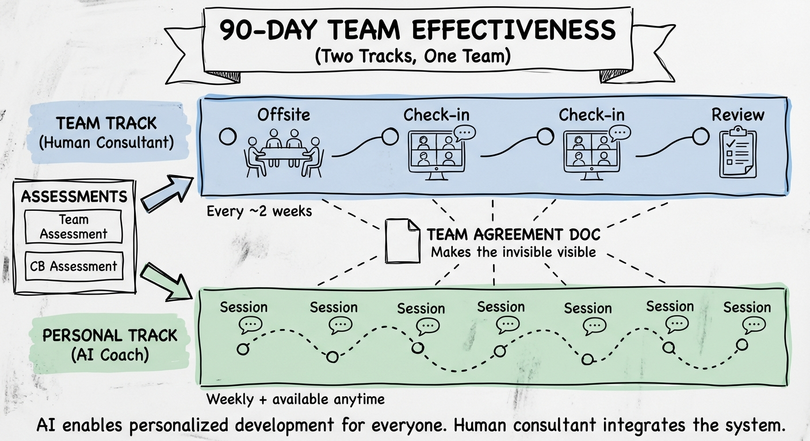
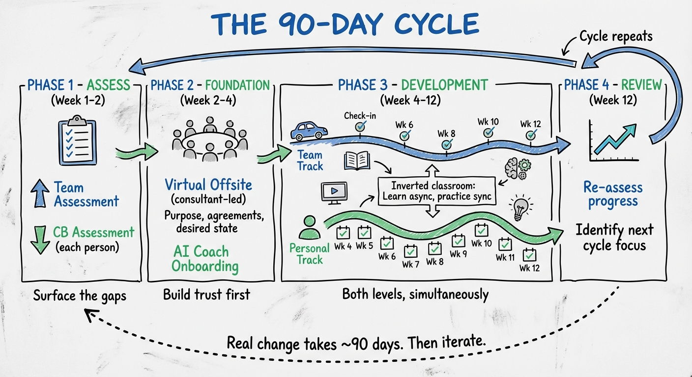
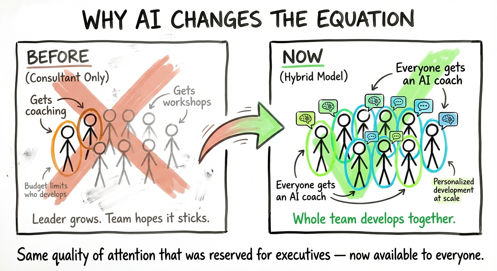
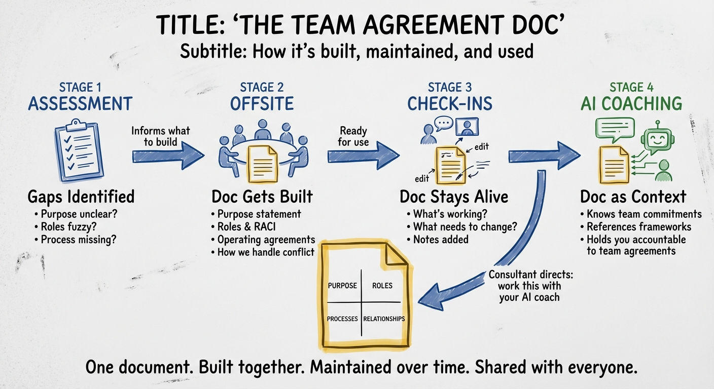

# Team Performance MVP — Hybrid Approach

**Purpose:** Validate this concept with Horacio (27 Jan 2026)

**See also:** [AI Coaching Dependency](ai-coaching-dependency.md) — what we need to build for this to work

---

## The Offer

**90-day Team Effectiveness Cycle** — combining human consulting with AI-powered personal coaching.

We help your team become more effective by working both levels simultaneously:
- **Team level:** Human consultant facilitates alignment, teaches frameworks, catches patterns
- **Personal level:** AI coach for each person — personalized skill development at a pace that wasn't possible before

---

## How It Works

### Phase 1: Assessment (~Week 1-2)
- **Team assessment** — How the team functions across the 4 quadrants (Purpose, Roles, Processes, Relationships)
- **Individual CB assessment** — Personal behavioral patterns for each team member
- **Personalized debrief** — Each person receives their results with interpretation

### Phase 2: Foundation (~Week 2-4)
- **Virtual offsite** (consultant-led) — Establish purpose, operating agreements, desired state
- **AI coach onboarding** — Each person gets matched with their personal development track based on assessment

### Phase 3: Development (~Week 4-12)
Two parallel tracks running simultaneously:

| Personal Track (AI) | Team Track (Human) |
|---------------------|---------------------|
| Weekly AI coaching session | Consultant check-in every ~2 weeks |
| Skill development tailored to individual gaps | Facilitated discussions on team-level issues |
| Practice conversations, reflection, role-play | Puts concepts into practice (not lecturing) |
| Available anytime for processing conflicts | Observes patterns, adjusts intervention |

**Inverted classroom model:** People learn concepts async (materials, videos) before consultant sessions. Human time is spent practicing, not teaching — so every touchpoint is high-value.

### Phase 4: Review (~Week 12)
- Re-assess progress
- Identify next cycle focus
- Decide continuation

---

## Why It Works

The program surfaces what's normally invisible:

- **Team assessment** reveals the gap between how you work and how you want to work
- **CB assessment** reveals each person's mindsets and patterns
- **AI coaching** gives each person space to examine their thinking and behavior — on the things they actually care about — with distinctions that make the invisible visible
- **Human consultant** connects the dots across individuals and team, catching patterns no one else can see

You can't change what you can't see. This program makes the invisible visible — at both individual and team levels — so change becomes possible.

---

## Why AI Changes the Equation

A consultant can't coach everyone — budget doesn't allow it. In a typical engagement:
- The leader gets coaching
- Maybe 2-3 key people
- Everyone else gets workshops and hopes it sticks

**AI coaching means every person on the team gets the deep, personalized mindset work.** The whole team develops together, not just the top.

This is the unlock: the same quality of individual attention that was reserved for executives, now available to everyone on the team — so the team can change as a unit.

---

## The Team Agreement Doc

A living document that ties everything together — structured around the 4 quadrants, built in the offsite, maintained through check-ins, and shared with AI coaches.

**What it is:**
- A shared doc in the team's existing workspace (Notion, SharePoint, Word)
- Structured around the 4 quadrants: Purpose, Roles, Processes, Relationships
- Pre-populated as a template, filled in during the offsite

**How it's built:**
1. Assessment identifies gaps ("purpose unclear", "no decision process")
2. Offsite is designed to fill those gaps — the team builds the doc together
3. By AI onboarding, the doc is ready — every coach has team context

**How it stays alive:**
- Updated in consultant check-ins (hands-on work sessions)
- Notes captured when things evolve ("we discussed X, here's how we'll handle it")
- Consultant can direct: "work this with your AI coach" or "let's tackle this as a team"

**Why it matters for AI coaching:**
The AI doesn't just know your personal patterns — it knows:
- What the team committed to
- What came up in the last check-in
- What the consultant suggested you practice

So when you say "I have a hard conversation coming up," the AI can reference the team's framework for difficult conversations.

---

## The Accountability Model

**Key insight:** Social accountability makes individual change stick.

- **Team contract** — Everyone commits to doing their personal development work (weekly AI sessions)
- **Visible commitment:** "I did my session" is visible to the team (leaderboard or similar)
- **Private content:** What you work on with your AI coach stays private
- **Consultant visibility:** Aggregate patterns only — "3 people are working on listening" — to inform team interventions

---

## Why the Human Consultant Is Still Essential

- Runs team-level interventions (offsites, facilitated practice)
- Interprets assessment, designs the engagement
- Catches patterns in live team dynamics that AI can't see
- Puts concepts into practice — the high-value work that can't be async
- Provides stewardship / quality control on AI coaching
- Connects dots across individuals — sees the system

---

## Questions for Horacio

1. **How do you currently manage the individual ↔ team connection?** When you're doing both coaching and team work, how do you handle information flow? What do you share, what stays private?

2. **Does this structure make sense?** The 90-day cycle, the two parallel tracks, the touchpoint frequency?

3. **What's missing?** What do you do in HPT engagements that isn't captured here?

4. **The accountability model** — Is "commitment to process" (not content) the right boundary? How do you currently create accountability for individual work?

5. **What would make you skeptical this could work?** What are the risks or failure modes you'd watch for?

---

## Open Questions (Internal)

- How does the AI know what happened in the team offsite? (Need connection between tracks)
- What's the minimum viable team size? Maximum?
- Pricing model — per person? Per team? Per cycle?
- How do we handle someone who doesn't engage with their AI coach?

---

*Draft: 26 Jan 2026*
